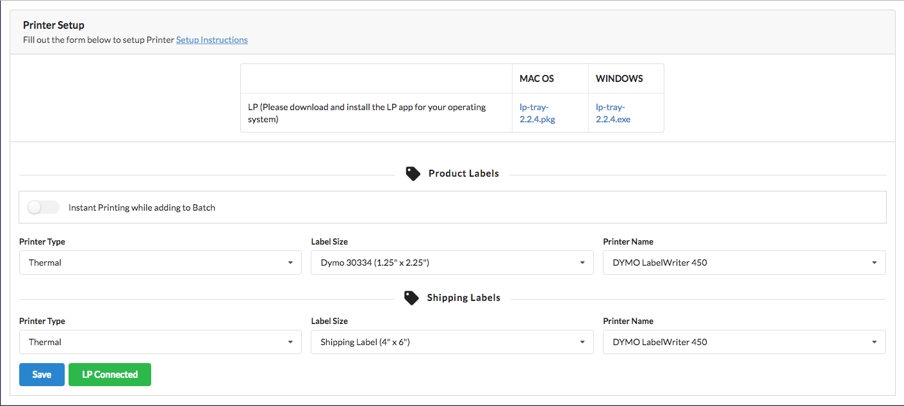

# Introduction

### Onboarding {#step1}

#### Step 1**:**

Complete the form and Register your account.

#### Step 2**:**

Enter your credit card details to activate your account. You can also apply for promo code.

### Setup MWS Credentials {#step2}

#### Step 1

Authorize the app in Seller Central. Go to Seller Central and click the “Settings” button and then choose “User Permissions”.  ****

#### Step 2:

Click the Authorize a developer button.

#### Step 3: ****Complete form as shown below.  

**Application Name:** MinMaxInd

**Application’s Developer Account Number:** 6827-5609-8009    
****

#### Step 4:

Copy the Seller ID and Auth Token you get from the form above into the “Setup” form in the One App.

### Step 5:

After the app has been setup with your MWS Credentials. This will automatically sync the dashboard, inventory, orders, finances, shipments, FBA reports, reimbursement and restock history and reports data.

Give the Sync process time to complete \(it will vary depending on the number of items in your catalog\). Once the process completes you will see all of your inventory items in the Inventory page. The process might take approximately three to four days.

### Setup Printer {#printer}

Set up your printers. Each dropdown is self-explanatory as to which printer you are setting up. If for any reason you do not see any printers in the dropdown it means that the LP application is not running on your computer. Just run the program and you should then see your printers listed. The LP program that was installed at the beginning of your setup process is the key to the web application being able to print. It MUST be running in the background at all times so if you restart your computer for some reason you will need to run the installed program again before going to the web app.

After you set up your printers. You will be able to print labels through the app either from inventory or shipments page. We have provided many other ways as well to print labels in our app. You can enable Instant Printing while adding products to batch.

