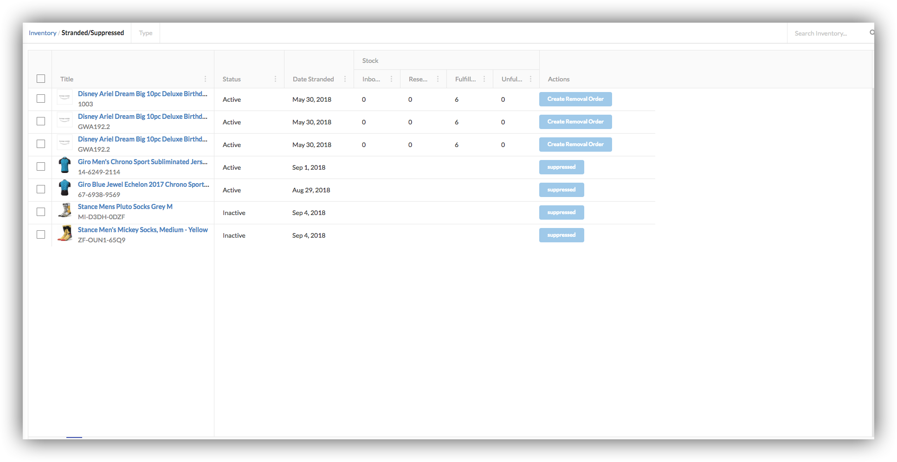
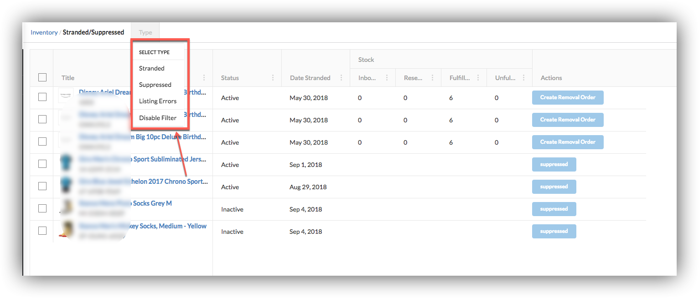

# Suppressed / Stranded

We enables our users to view suppressed/stranded products.  
Stranded products are those which have some issues related to Dimensions etc and respective action need to fix them.  
Suppressed products are those which have pixel issues.

Users can apply filters to fetch products of specific type.

