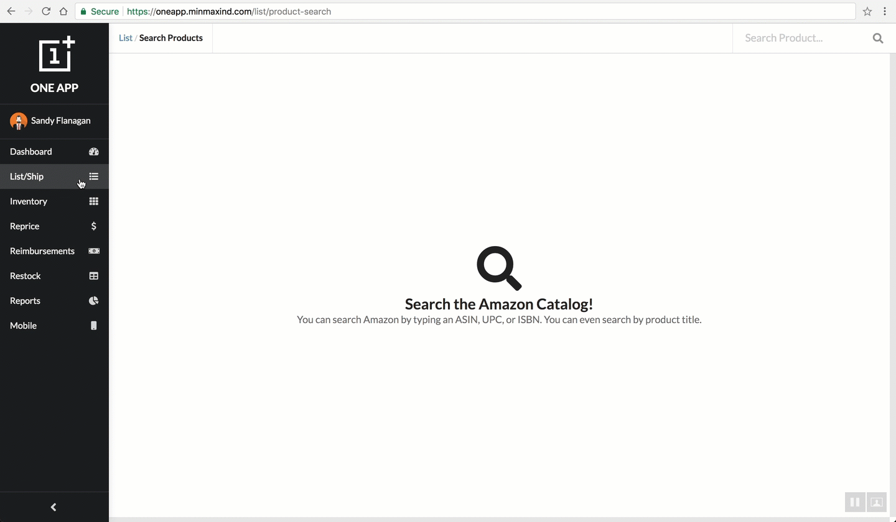
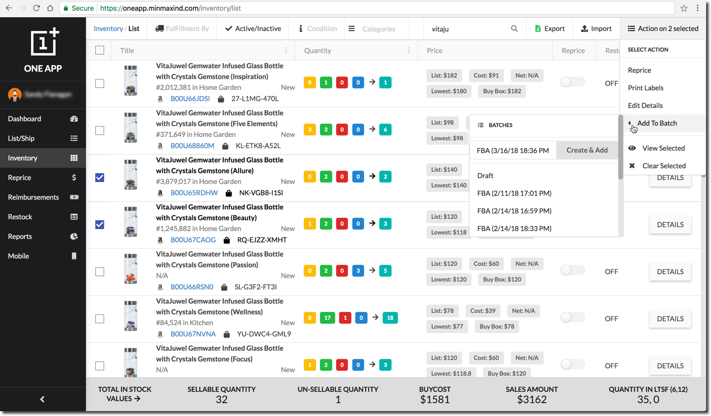
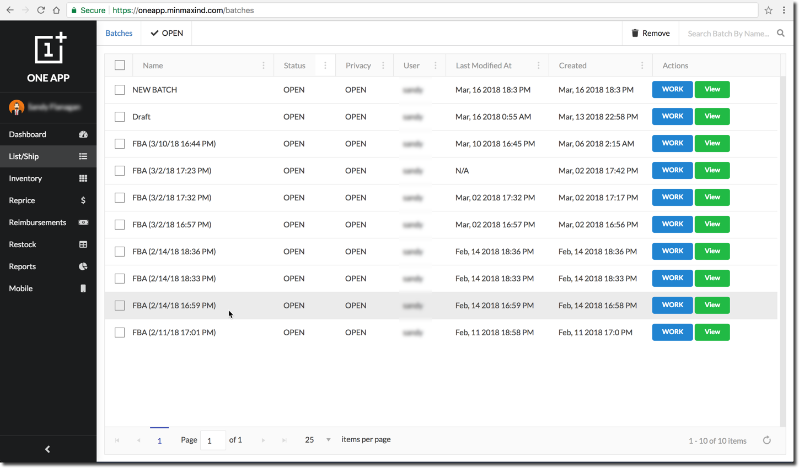
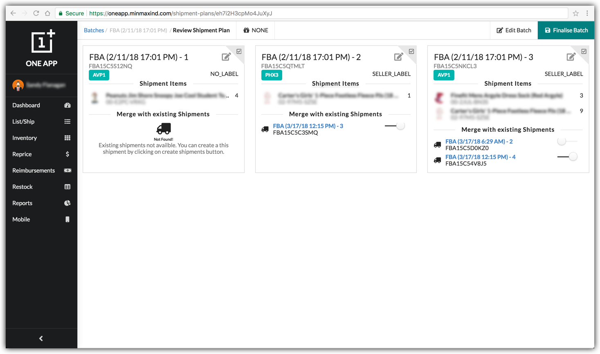
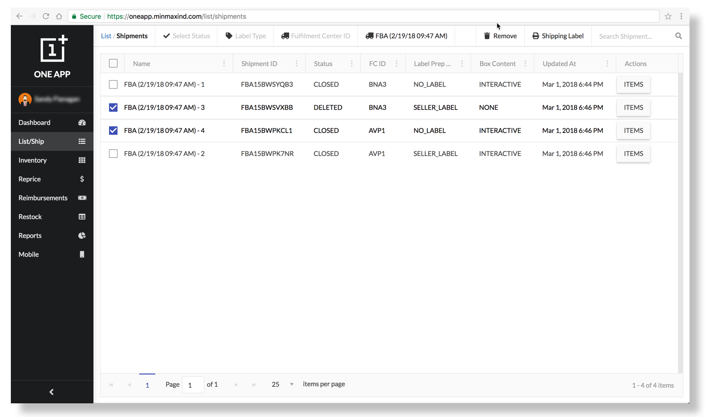

# LIST/SHIP

## STEP 1: ADD TO CATALOGUE

Seller can add a product to catalogue by any of following Methods.

* [ADD TO BATCH](list-ship.md#step1-1).
* [ADD TO SHIPMENT](list-ship.md#step1).

## ADD TO SHIPMENT {#step1}

### FROM LIST PRODUCTS PAGE

1\) Search a product using Title, ASIN, UPC, EAN or ISBN on List/Ship → List Products page.


2\) Click on `Add to Shipment` button to add a product to a shipment.


3\) If Product is previously Added To Catalogue Seller Sku is selected in MSKU Dropdown else Seller can use ADD NEW option of MSKU Dropdown to **Generate** a new SKU.


4\) Enter **Ship From Warehouse**, **Packing Type** and **Labelling Preference** to add product to shipment.


5\) Add Quantity to ship and you can Edit any Information you want.


6\) After adding all the details to product. Click on `Add to Shipment` button to add a product to a shipment. It will take you to the Shipment → Review page.


7\) After verifying your related information on [**Review Page**](list-ship.md#review-items-page) click on `Create Shipments` button to Ship Product according to Quantity.



Product is Added To Catalogue if you use ADD NEW option of MSKU Dropdown.


### FROM INVENTORY/LIST PAGE

1\) Select items you want to add to shipment.


2\) Click on `Add to Shipment` option to add products to a shipment.


3\) Enter **Ship From Warehouse**, **Package Type** and **Labelling Preference** to add product to shipment.


4\) Add Quantity of Product\(s\) you want.


5\) You can also enter\(if any\) Purchase Data, Cost Price, Supplier and Expiration Date for each product.


6\) Use Add Split on Product Quantity to Ship Product if there is difference of Data\(Purchase Data, Cost Price, Supplier or Expiration Date\) between them.


7\) After adding all the details to product. Click on `Add to Shipment` button to add products to a shipment. It will take you to the Add To Shipment → Review Items page.


8\) After verifying your related information on [**Review Page**](list-ship.md#review-items-page) ****click on `Create Shipments` button to Ship Product according to Quantity.


### REVIEW ITEMS PAGE

1\) By Default Review page shows you Product Wise Data.


2\) Click on`View Shipments`Button to view Review page in Shipment View.


3\) Use following Dropdown to change Box Content Source.


4\) Hover on the printer icon to edit quantity of labels to be printed and click printer icon button.


5\) Click on the edit icon to edit product details.


6\)To increase/decrease the quantity of product perform following tasks.

     1\) Click `Change`Button.


     2\) Click on `+`Button to Add a Split.  
     3\) Enter Data.  
     4\) Click on `Save Changes`Button to Save.  
     5\) Click on`x`Button to Remove a Split.


7\) By default existing WORKING shipment has been selected. You can hover on the shipment ID to choose from existing WORKING shipments or new shipment \(If you don't want to merge with any existing shipment\).


8\) Initially default name is provided for new shipments, However you can edit the shipment name.


9\) You can view the existing items inside shipment by clicking on info icon in front of the shipment ID.


10\) Once you finished reviewing the items. Now you can click on`Create Shipments` button to add the items to shipments on amazon.


## ADD TO BATCH {#step1}

### Products not in Seller’s Catalog:

1. Search a product using Title, ASIN, UPC, EAN or ISBN on List/Ship → Search Product [page](https://oneapp.minmaxind.com/list/product-search).
2. Click on `Add to Batch` button to add a product in a batch.
3. Seller can manually add a SKU or generate a new SKU using the button Generate MSKU.
4. Similarly you can add in your Product Cost Price/List Price and required Quantity to ship.
5. Seller can add in Minimum/Maximum Sell Price for a repricer at the time of adding a product, similarly he can choose the reprice strategy to be applied to this product, reprice can be enabled for this product right away using the Reprice toggle button on this form, which would only be enabled if min, max price and strategy is selected.
6. Seller can choose from the dropdown if he wants to add a product to a `DRAFT`_**\(default\)/**_`OPEN` /`NEW` ****batch

> ```text
> Before shipping a product to Amazon, it is must to list product in seller’s catalog.
> If seller wants to list a product using a different SKU he also has to choose this process.
> ```

### Products Exist in Seller’s Catalog:

#### Add Single Product to Batch:

1. Search a product using Title, ASIN, UPC, EAN or ISBN on List/Ship → Search Product page.
2. Click on Add to Batch button to add a product in an DRAFT or OPEN batch.
3. By default first Amazon fulfilled product exists in a catalog would be selected with a condition and SKU, seller can choose from a list if it has multiple products with that ASIN, Form would be auto filled with last used values for this product.
4. Similarly you can add in your Product Cost Price/List Price and required Quantity to ship.
5. Seller can add in Minimum/Maximum Sell Price for a repricer at the time of adding a product, similarly he can choose the reprice strategy to be applied to this product, reprice can be enabled for this product right away using the Reprice toggle button on this form, which would only be enabled if min, max price and strategy is selected.
6. Seller can choose from the dropdown if he wants to add a product to a DRAFT or OPEN batch.

#### Add Multiple Products to Batch:

1. Go to Inventory → List Page, find products using custom filters, Seller can select multiple products using checkbox, selected products would be preserved while you can change filters and select other products for the batch. You can view selected products anytime using the View Selected option, and clear selection using Clear Selection option.
2. Seller can choose from the Add To Batch dropdown if he wants to add a product to a `DRAFT` or `OPEN` batch.

## STEP 2: WORK ON BATCH {#step2}

Here's a line for us to start with  
1. Go to List/Ship → Batches page to finalize your OPEN/DRAFT batch.  
2. To finalize click on `WORK` button to continue to Create Shipment Plan page.

> ```text
> By default batch privacy would be OPEN to every user, which means any user can add items to this batch,
> if it is LOCKED only a user who has created can add items
> ```

1. User can edit the batch name, select the batch privacy, ship from warehouse, package and label types for a particular batch.
2. Seller can manually enter/update any field directly or use the Add Details to Selected button to bulk edit the Cost Price, Minimum price, Maximum price or Quantity.


> ```text
> Product Catalog Status (hover on status for details)
> EXIST: Product Already exist in seller’s catalog
> **PENDING**: Adding a new product to catalog is in progress
> ERROR: A Product cannot be added to seller’s catalog because of any error, you cannot go to next step without removing this product from the batch.
> ```

1. You can press Create Shipment Plan button to proceed, in case of errors you can see the errors on screen and you need to fix

   any errors mentioned.

## STEP 3: FINALISE BATCH {#step3}

1. A shipment plan would suggest to create multiple shipments recommended by Amazon based on Fulfilment center and Label Type. App would show any existing shipments for the same Fulfillment Center and Label type next to a shipment recommended by amazon so that can be merged. If you want to merge with an existing shipment you can mark the checkbox otherwise a new shipment would be created. A recommended shipment can be removed using a \(x\) button at the end of row.
2. You can also select the Box Content Source for the newly created shipments from the top menu, you can choose between ****`NONE`_**\(default\)**_, `2D Barcode` and `FEED`
3. You can press Create Shipments to proceed, you would be taken to shipments page where you can view the shipments created by this particular  batch.

## STEP 4: PACK BATCH {#step4}

1. You would be redirected to **List/Ship → Shipments** [page](https://oneapp.minmaxind.com/list/shipments) to finalise a shipment.
2. You can `Edit`**/**`Update`**/**`Remove` ****and Print Shipping Labels for any shipment.
3. Click on `ITEMS` button to View/Pack shipment items into boxes.
4. Select the items using the checkbox, you can add a custom quantity to a box by editing the Qty to Box field, click on the Add to Box button to add items into an existing box or create a new box.
5. Item quantity in a box can be edited in the box and you are also able to add a custom expiry date to a product.
6. A product can be removed from a box using delete button, Item label can be printed using the print button.
7. Shipment Item List shows the number of products in a particular box and the remaining quantity to be packed.
8. When All items are successfully packed to boxed you can submit a feed using a Submit Feed button on the top.


