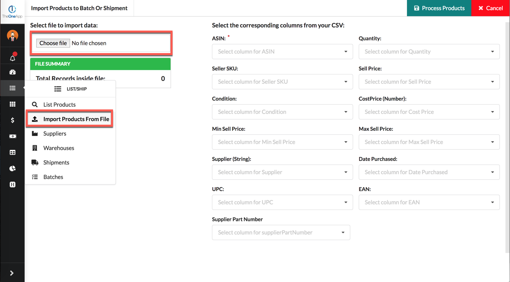
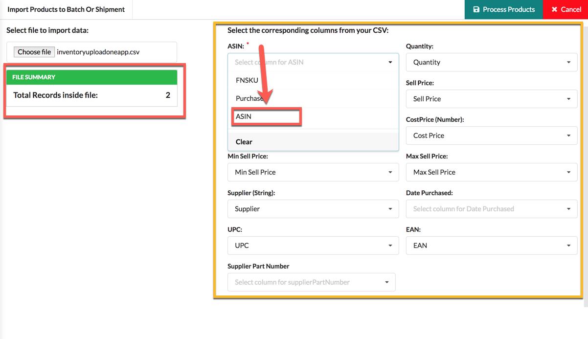
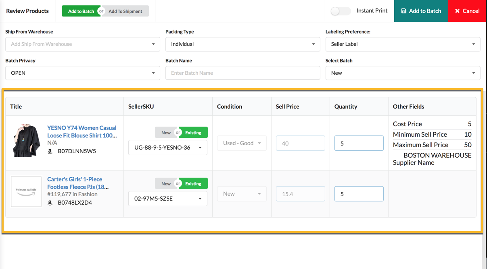
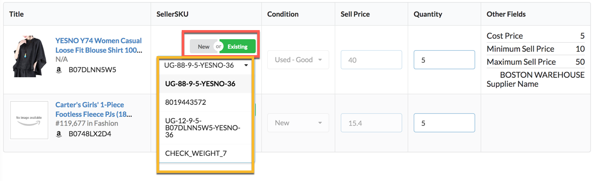
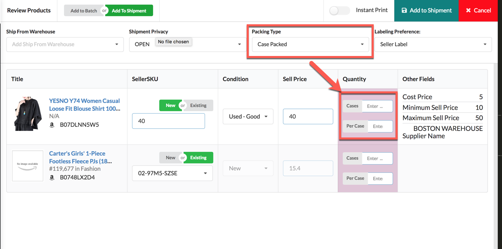

# Import Products From File To Batch/Shipment

## STEP 1: UPLOAD FILE

At the first step, you need to upload file from **Choose File** option.

Then it will populate data from file. You can see the **File Summary** to see the information like **Total Records** in the file. 

Then you need to select corresponding columns for the mentioned fields.

> You must have to select corresponding columns for required fields e.g ASIN

Now click the **Process Products** button to process the data of file which will move you to the **Review Products** page.

## STEP 2: REVIEW PRODUCTS

Here you can review the details of the product before adding to batch/shipment.

If you already have products against ASIN then you can choose either you want to replenish your existing inventory \(By selecting **Existing** option under **SelllerSKU** column\) or want to add new product to catalog \(By selecting **New** option under **SelllerSKU** column\).

You can also select **Case Packed** option from **Packing Type** and then enter respective quantity ****in **No. Of Cases** and **Quantity Per Case** field.

After reviewing the details, Now you can click on the **Add To Batch/Add To Shipment** to further process products.

