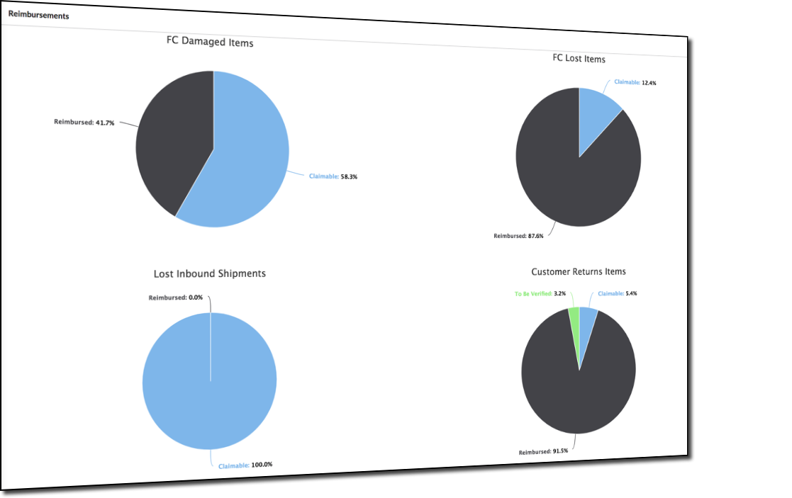

# REIMBURSEMENT

## Dashboard 

Dashboard page of reimbursement module enables users to get overview of the stats related to different reimbursements \(Damage, Lost, Lost Inbound Shipments and Customer Returns\)

