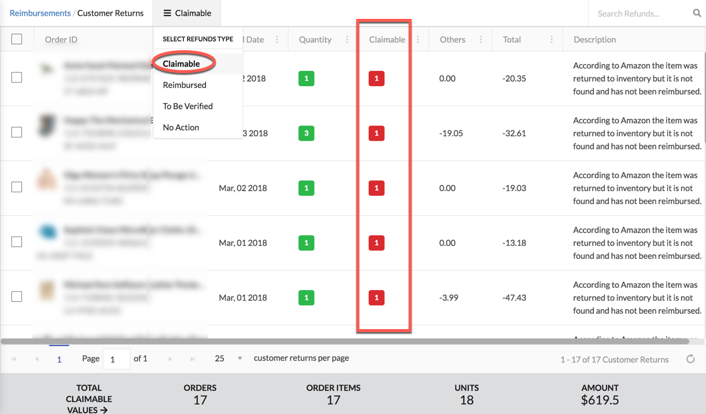
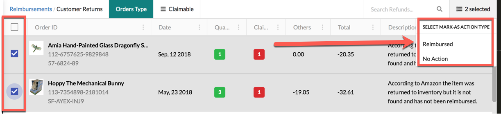

# Customer Returns

## CLAIMABLE:

Claimable page shows the items you need are required to open up a case. **Claimable** column shows the quantity to claim for respective product.

All the above information is required for you to be able to claim any particular product.

After opening up a case, you can mark order as **Reimbursed** or **No Action**. So that order will not appear again in **Claimable** page as you already claimed the order.

## REIMBURSED:

This page shows the orders which are already reimbursed by amazon.

## NO ACTION:

This page shows the orders for which you don't need to perform any action

