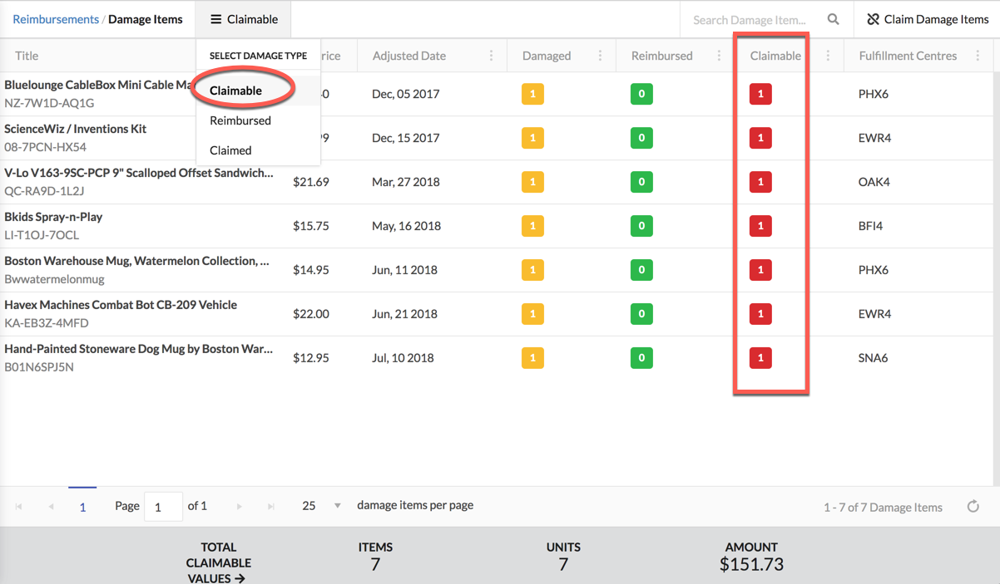
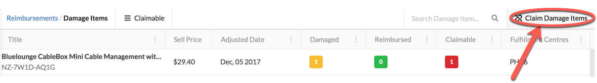
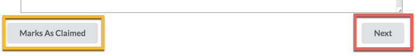

# FC Damage Items

## CLAIMABLE:

Claimable items are the items that you needs to be claim and **Claimable** column shows the no of items you need to claim against product.

### How to Claim:

To claim damage items click the **Claim Damage Item** button.

This will open up a popup. Follow the process to open up a case to claim the products.  We automatically provide you with the template with required information.

_**You can claim only 5 items per case as well per day.**_

Once you opened a case you can mark those items as **claimed** by clicking **Mark as Claimed** so that you can no longer see these items in **Claimable** page as you already claimed**.** Then items will be moved to **Claimed** page.

By clicking the **Next** button you can view the template for next 5 items.

## REIMBURSED:

This page shows the items which are already reimbursed by amazon.

## CLAIMED:

This page shows the items for which you already opened up a case. You can move items from **CLAIMABLE** page to here.

