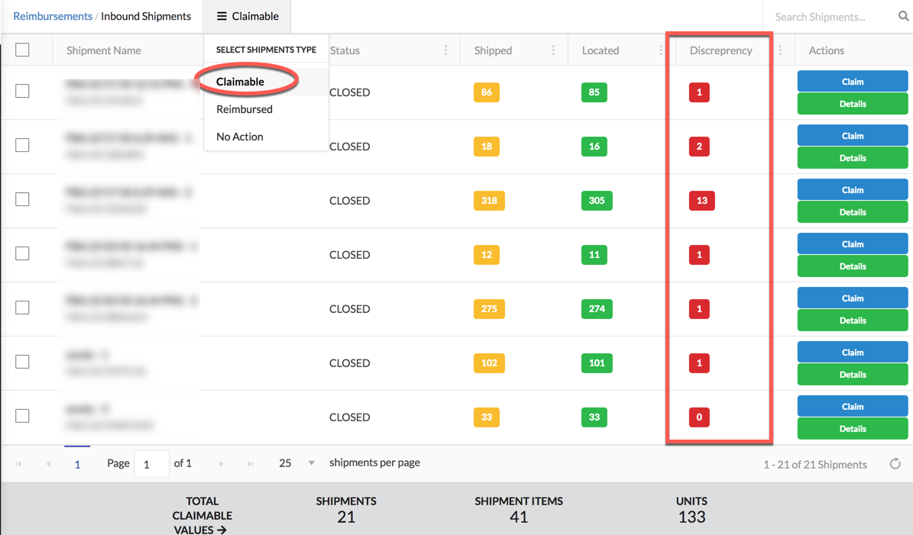
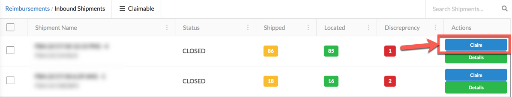
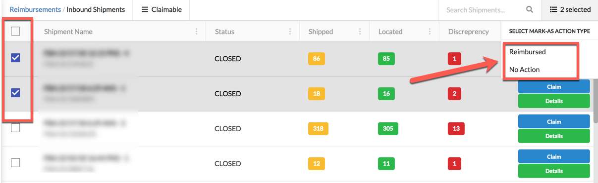

# Lost Inbound Shipments

## CLAIMABLE:

Claimable items are the items that you needs to claim. Discrepancy column showing the difference in the Shipped and Located Quantity for a shipment.

You can view the details of shipment by click **Details** button to review the status of individual items inside shipment. By default we show only those items which required to be claimed. You can view all of the shipment items status by selecting **All** in the menu.

### How to Claim:

To claim the lost inbound shipment items click the **Claim** button. Which will direct you to seller central page from where you can open up a case for missing items of your shipment.

After opening up a case, you can mark shipment as **Reimbursed** or **No Action**. So that shipment will not appear again in **Claimable** page as you already claimed the shipment.

## REIMBURSED:

This page shows the shipments which are already reimbursed by amazon.

## No Action:

This page shows the shipments for which you don't need to perform any action.

