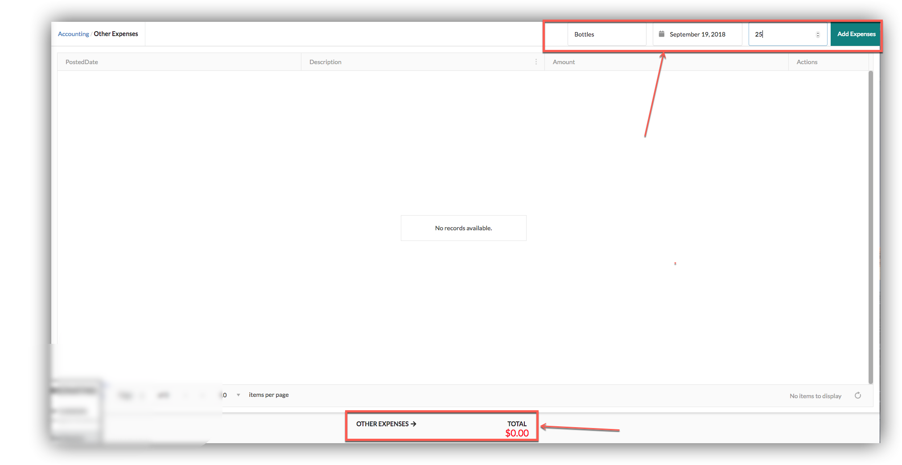
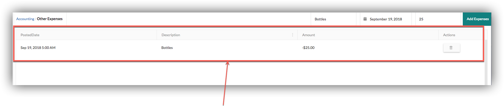

# Other Expenses

Users can add their other expenses from that page by clicking Add Expenses after adding Description, Date and Amount.Total other expenses shown in bottom bar.

If any other expenses added list will shown below from where users can edit irrelevant expense.

