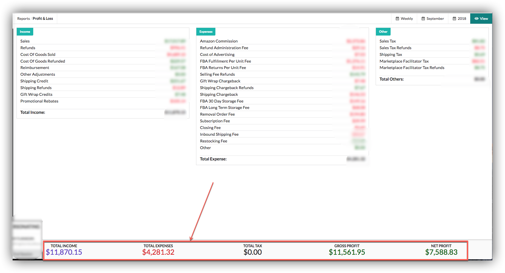
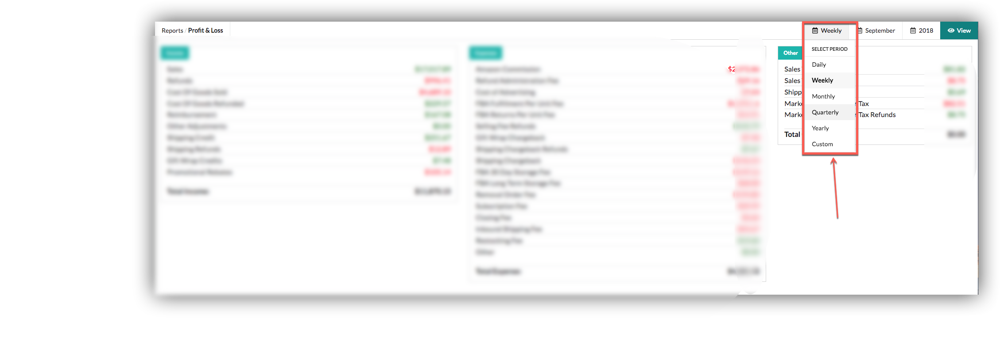
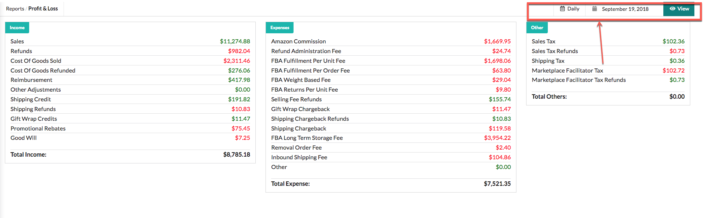
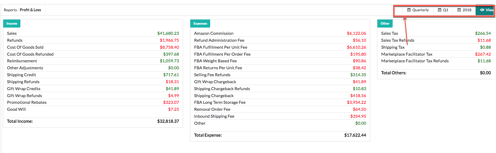
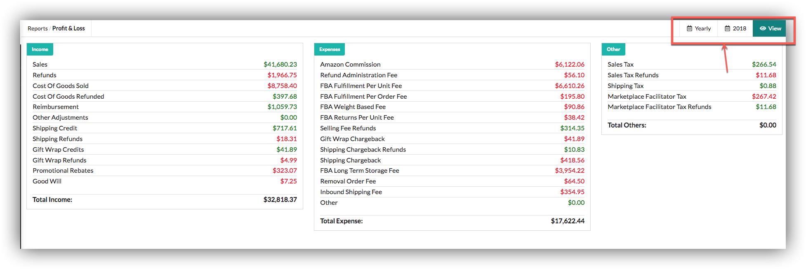
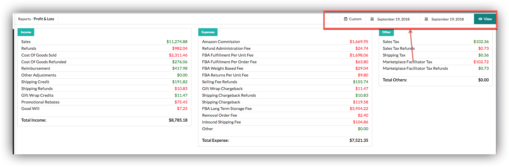

# Profit and Loss

Profit and loss page enable our users to view total Income , Expenses and Others.In bottom bar we are showing Total Income, Expenses, Tax, Gross Profit and Net Profit according to selected period.

### Selectors

Users can view profit and loss according to selectors.

### Daily

Users can view profit loss reports of different periods.

### Quarterly

### Yearly

### Custom Range

  

