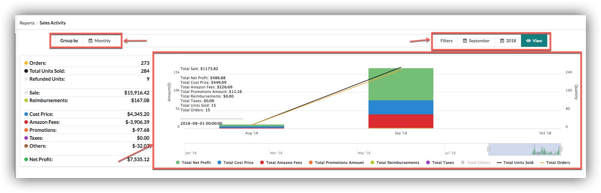
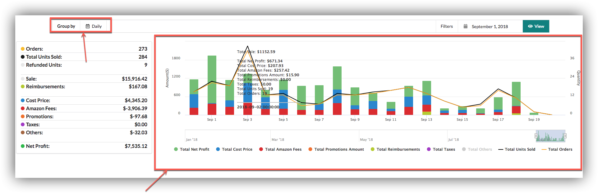
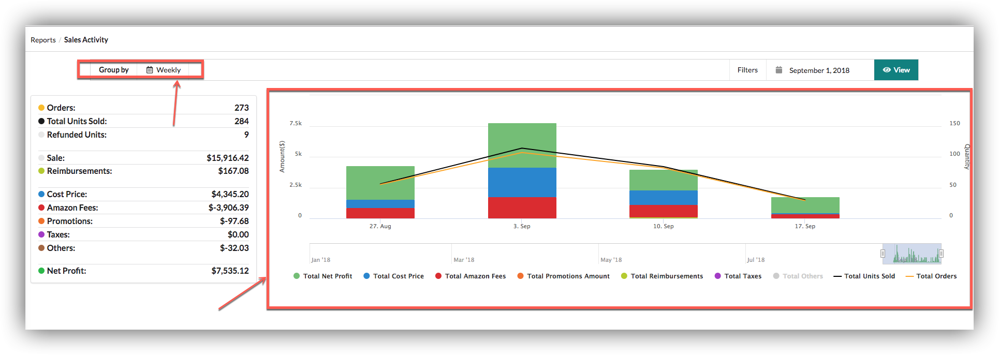
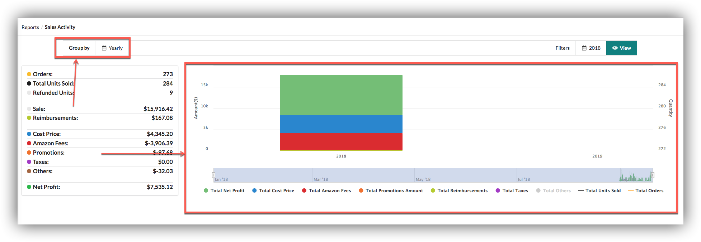
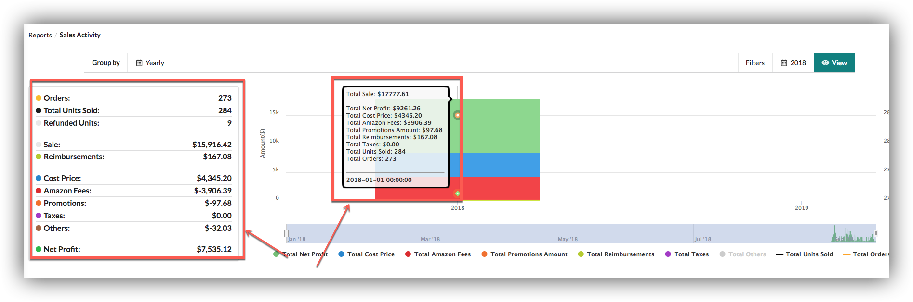

# Sales Activity

## Sales Activity

Users can view sales activity graphs according to group period, by default data grouped **monthly** basis.

### **Daily**

Users can view graphs on daily basis of selected months in filter.

### **Weekly**

Users can view graphs on weekly basis of selected month in filter.

### **Yearly**

Users can view graphs on yearly basis of selected year.

Users can view stats of sales from left side of graphs or by hovering graph.

