# REPRICER

## Dashboard {#1}


Our repricer has a Dashboard page which enables our users to check performance of Repricer in terms of Repricing Events, Pricing & Buy Box.

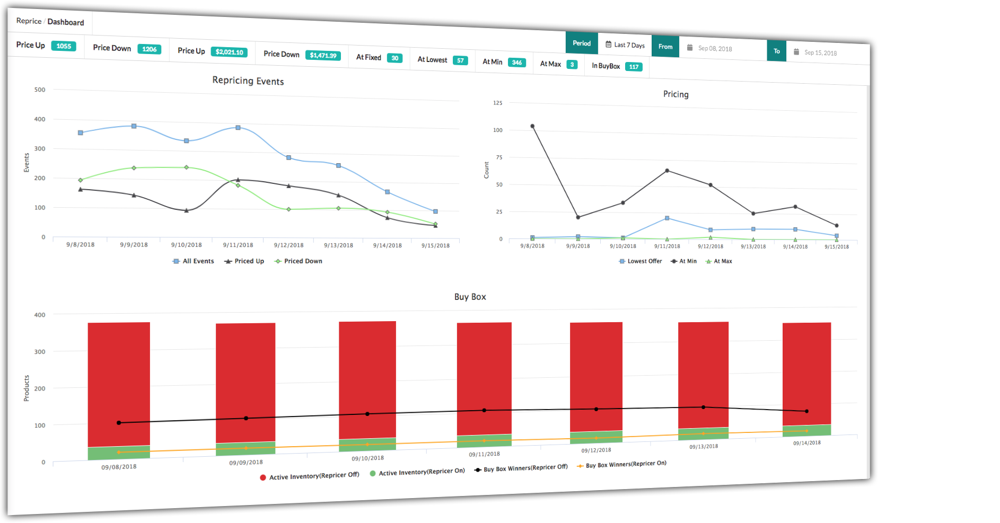

## Settings {#1-1}

Our repricer has a Settings page which has Option to Enable/Disable Repricer & Test/Live Mode.

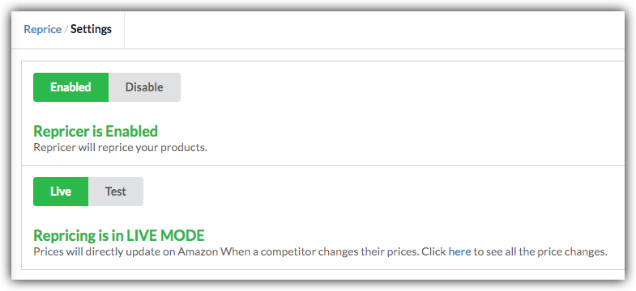

**Enable/Disable Repricer:**

We allow users to enable/disable the repricer. When user clicks on enable button, our repricer will be able to receive notifications for that user and start repricing. On the other hand, when user clicks on disable button, our repricer will not reprice the products price for that user. For products repricing users must enable the repricer.

**Test/Live Mode:**

Our repricer has two modes. Live Mode and Test Mode.

In Test Mode our repricer will reprice the products and display prices within our system in price history page with label Suggestion, where users can see change prices and confirm whether they want to upload them to Amazon or not. With Test Mode, you can try out our Repricer.

In Live Mode, we will upload these price changes directly to Amazon and we display all the price changes to Amazon within our system in price history page with label Done \(Feed is Submitted Successfully\).

If you want to see all the price changes of a Product visit details page of inventory within our system.

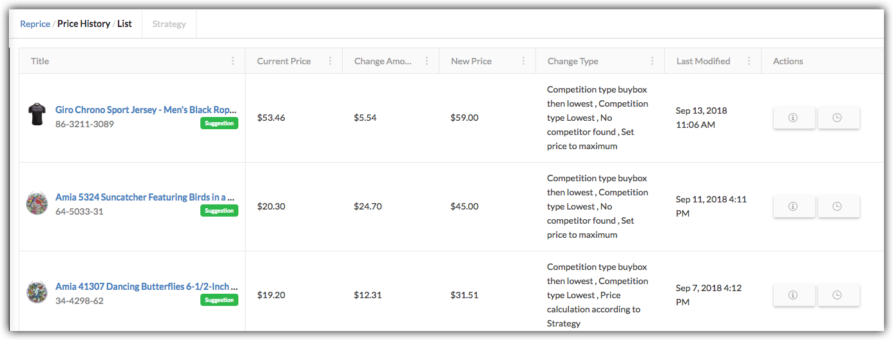

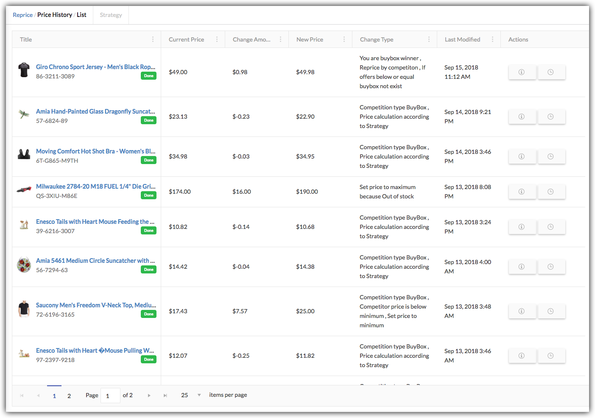

## Strategies

User can make different Strategies and then Reprice their Products depending on these Strategies.

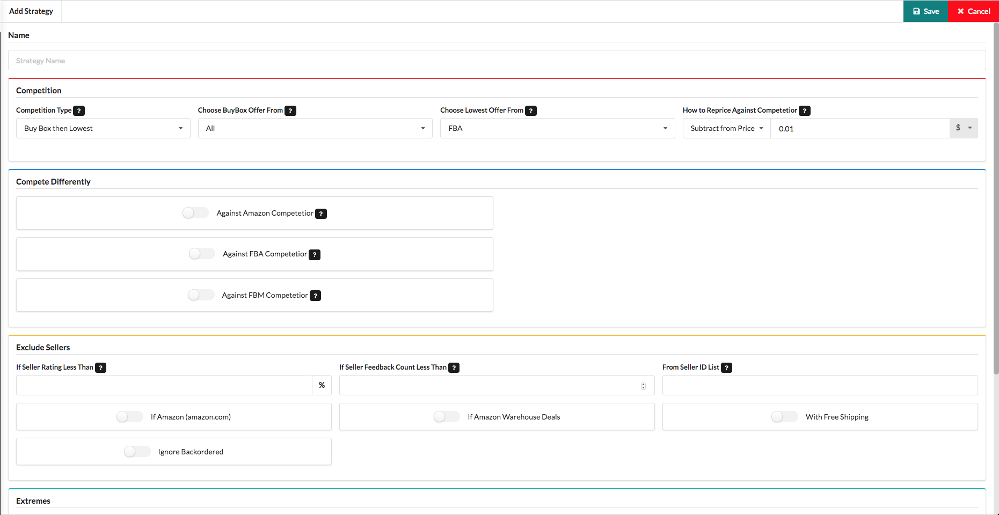

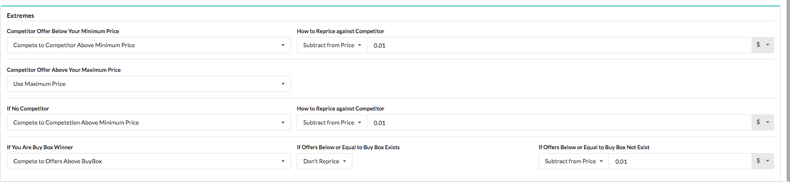

### Compete With Buy Box

We allow users to compete with Buy Box offer. Users are able to add/subtract/match to/from Buy Box price. In this rule, users may choose one option either Subtract From Buy Box Price or Add To Buy Box Price or Match To Buy Box Price. Users can enter price and select the price to plus/minus in % or $. According to this rule, Repricer will find the Buy Box offer and apply the strategy. Note: Buy Box we compete to can be FBM, FBA or Amazon.  
What if Buy Box price found less than product's minimum price or greater than maximum price or there is a possibility that there is no Buy Box offer or you are already in a Buy Box. In this case users can set rules for these scenarios in strategy.

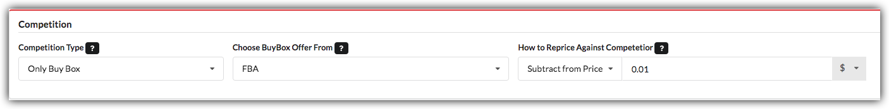

**When Competitor Below Your Minimum Price**  
 We allow users to select one of the following options in this case:  
**`Use Minimum Price`:** It will set price to Minimum Price.

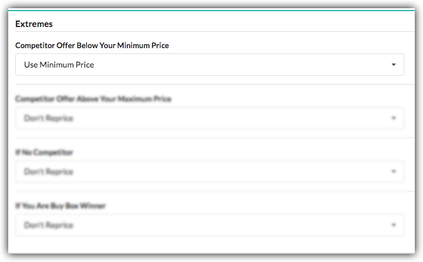

**`Compete to Competitor Above Minimum Price`:** It will find the price above your Minimum Price and add/subtract/match according to rule from it and sets a new price.

**`Don’t Reprice`:** It will not re-price.

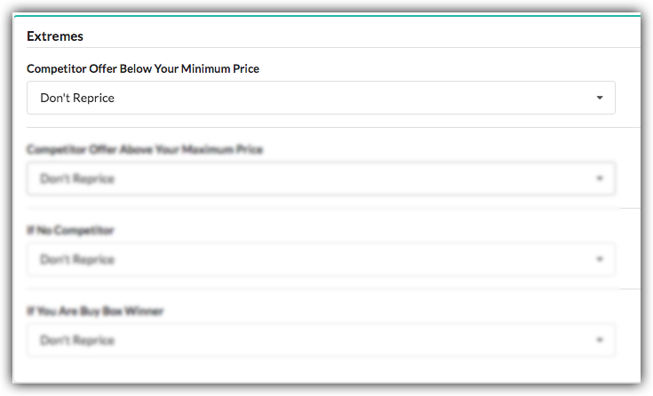

**When Competitor Above Your Maximum Price**  
 We allow users to select one of the following options in this case:  
 **`Use Maximum Price`:** It will set price to Maximum Price.

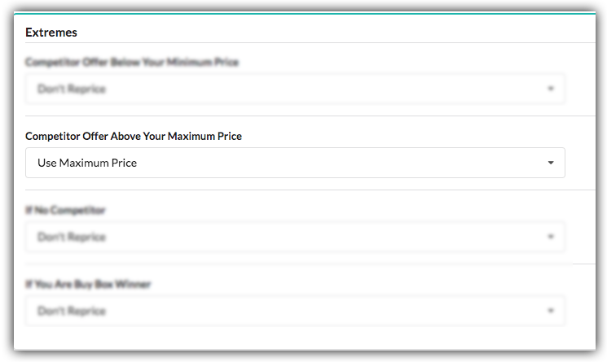

**`Compete to Competitor Below Maximum Price`:** It will find the price below your Maximum Price and add/subtract/match according to rule from it and sets a new price.

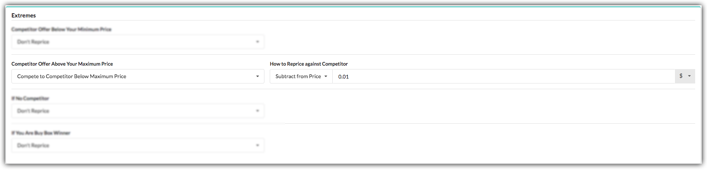

**`Don’t Reprice`:** It will not re-price.

**If No Competitor**  
 We allow users to select one of the following options in this case:  
 **`Set Maximum`:** It will set price to Maximum Price.

**`Compete to Competitor Above Minimum Price`:** It will find the price above your Minimum Price and add/subtract/match according to rule from it and sets a new price.

**`Don’t Reprice`:** It will not re-price.

**If You Are Buy Box Winner**  
 We allow users to select one of the following options in this case:  
 **`Compete to Offers Above Buy Box`:**  
 This Option has following two cases:     

        **If Offers Below or Equal to Buy Box Exists:** If these offers exist it enables us to add/subtract/match/don’t reprice according to rule from it and sets a new price.

        **If Offers Below or Equal to Buy Box Not Exists:** If these offers exist it enables us to add/subtract/match/don’t reprice according to rule from it and sets a new price.

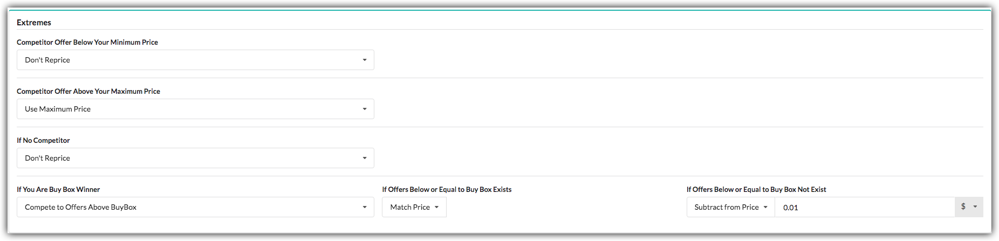

**`Don’t Reprice`:** It will not re-price.

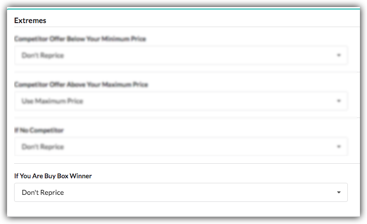

### Compete With Lowest Price

We allow users to compete with Lowest offer. Users are able to add/subtract/match from/to Lowest price. In this rule, users may choose one option either Subtract From Lowest Price or Add To Lowest Price or Match To Lowest Price. Users can enter price and select the price to add/minus in % or $. According to this rule, Repricer will find the Lowest offer price and apply the strategy.  
What if Lowest price found less than product's minimum price or greater than maximum price or there is a possibility that there is no Offer. In this case we allow users to set rules for these scenarios in strategy.

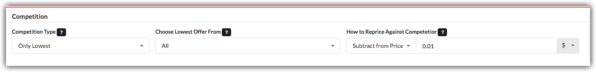

**When Competitor Below Your Minimum Price**  
We allow users to select one of the following options in this case:  
**`Use Minimum Price`:** It will set price to Minimum Price.

**`Compete to Competitor Above Minimum Price`:** It will find the price above your Minimum Price and add/subtract/match according to rule from it and sets a new price.

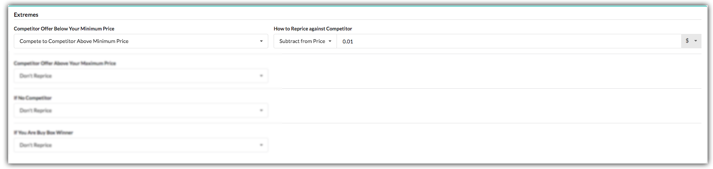

**`Don’t Reprice`:** It will not re-price.

**When Competitor Above Your Maximum Price**  
We allow users to select one of the following options in this case:  
 **`Use Maximum Price`:** It will set price to Maximum Price.

**`Compete to Competitor Below Maximum Price`:** It will find the price below your Maximum Price and add/subtract/match according to rule from it and sets a new price.

**`Don’t Reprice`:** It will not re-price.

**If No Competitor**  
We allow users to select one of the following options in this case:  
 **`Set Maximum`:** It will set price to Maximum Price.

**`Compete to Competitor Above Minimum Price`:** It will find the price above your Minimum Price and add/subtract/match according to rule from it and sets a new price.

 **`Don’t Reprice`:** It will not re-price.

### Compete With Buy Box Then Lowest

We allow users to compete with [**Buy Box**](./#compete-with-buy-box) ****Offer. What if the Buy Box Offer Not Exist? If so, then we provide a mechanism to user in which they can compete to [**Lowest**](./#compete-with-lowest-price) ****Offers.

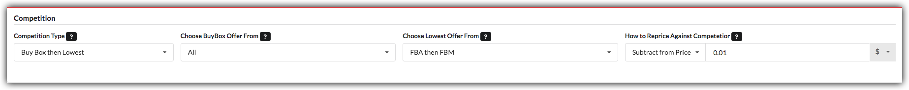

### Compete With Lowest Then Buy Box

We allow users to compete with [**Lowest**](./#compete-with-lowest-price) ****Offer. What if the Lowest Offer Not Exist? If so, then we provide a mechanism to user in which they can compete to [**Buy Box**](./#compete-with-buy-box) ****Offers.

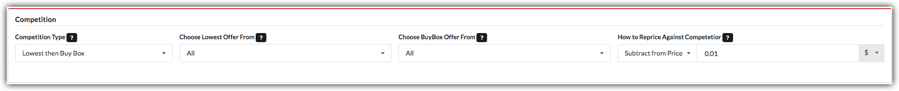

### Type Of Sellers

There can be following possible sellers which user wants to compete with:  
**`FBA`:** Compete with Fulfilment By Amazon Sellers.  
**`FBM`:** Compete with Fulfilment By Merchant Sellers.  
**`FBA then FBM`:** Compete with Fulfilment by Amazon Sellers if they exist else Compete with Fulfilment by Merchant Sellers.  
**`FBM then FBA`:** Compete with Fulfilment by Merchant Sellers if they exist else Compete with Fulfilment by Amazon Sellers.  
**`All`:** Compete with All Sellers.

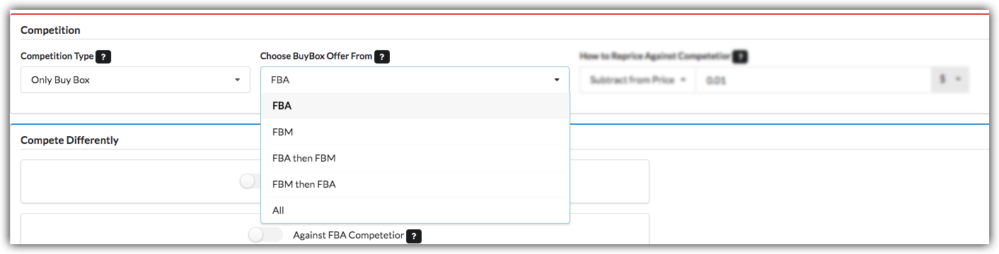


There is default\(How to Reprice Against Competitor\) setting available for How To Reprice Against Competitor. If one wants to have different settings for Amazon, FBA or FBM Seller see Compete Differently section.


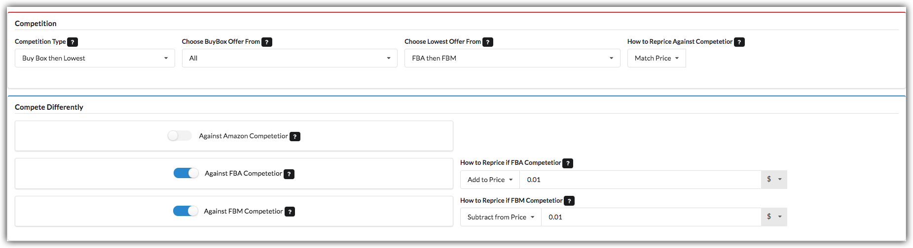

### Exclude Sellers

User can exclude sellers while competing to other offers. Users can select following options to exclude sellers:  
**`If Seller Rating Less Than`:** User can enter Seller Rating to exclude sellers. Repricer will not compete with the Seller Rating less than to the number that user enters.  
**`If Seller Feedback Count Less Than`:** User can enter Seller Feedback Count to exclude sellers. Repricer will not compete with the Seller Feedback Count less than to the number that user enters.  
**`From Seller ID List`:** User can enter multiple Seller Ids to exclude them from competing with. Repricer will not compete with them.  
**`If Amazon`:** User can select this option to exclude Amazon Seller Offers.  
**`If Amazon Warehouse Deals`:** User can select this option to exclude Amazon Warehouse Deals Seller Offers.  
**`With Free Shipping`:** User can select this option to exclude Sellers with Free Shipping Offers.  
**`Ignore Backordered`:** User can select this option to exclude Backordered \(Not Shipping Currently\) Selling Offers.

