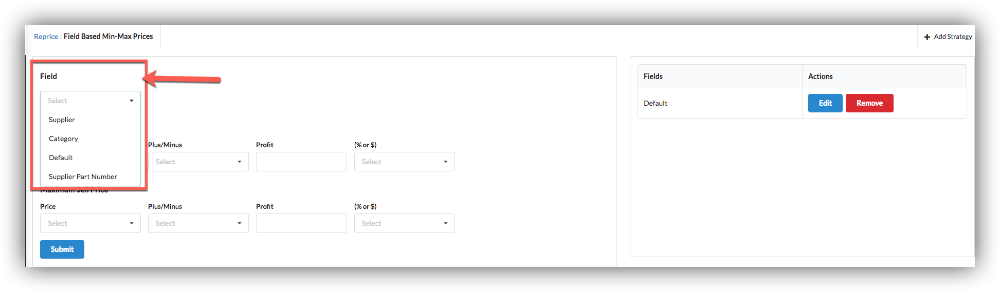
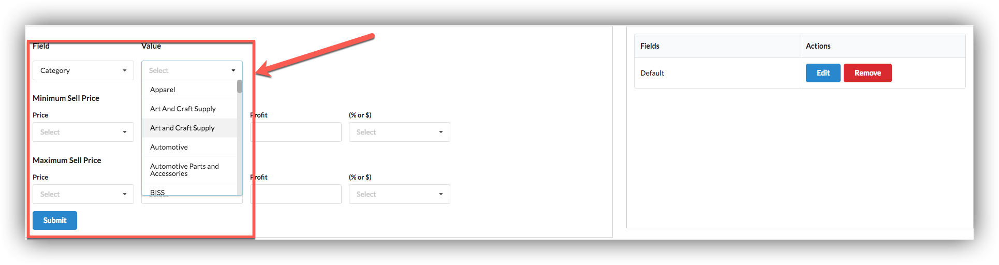
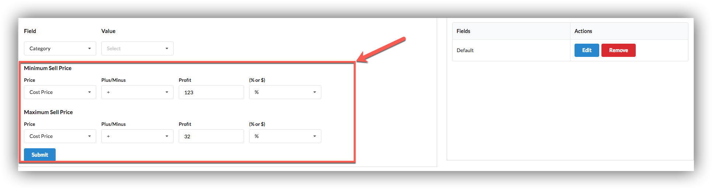
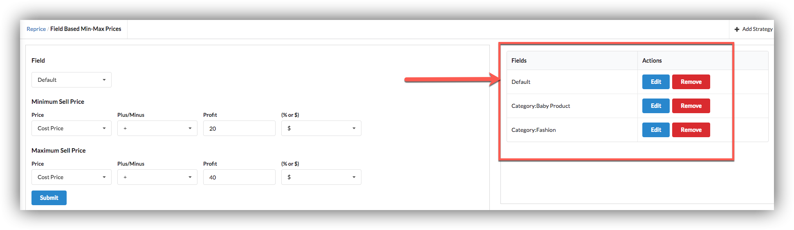
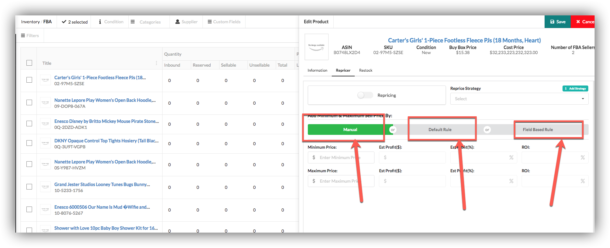
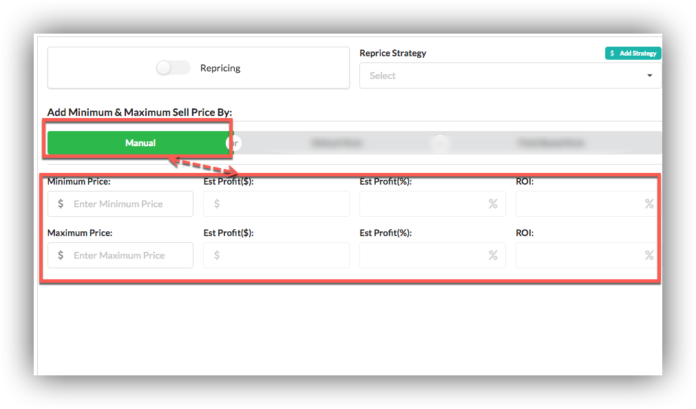
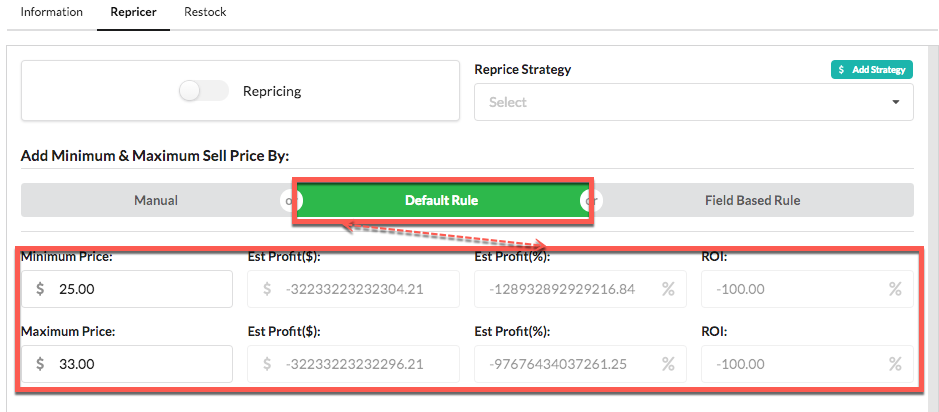
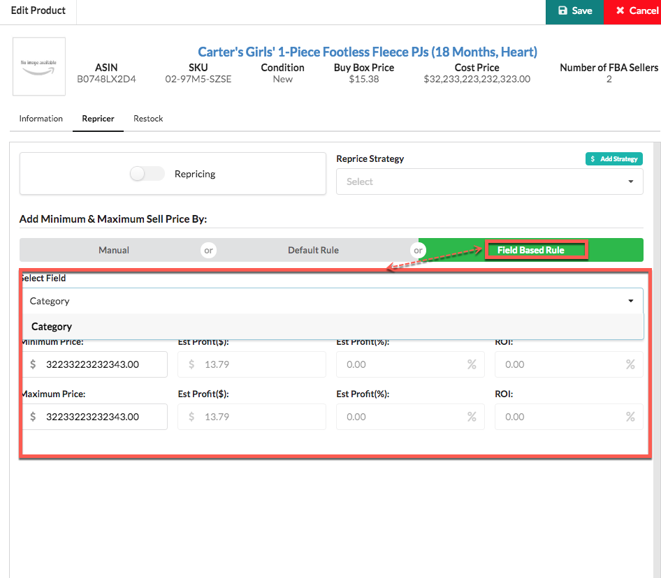
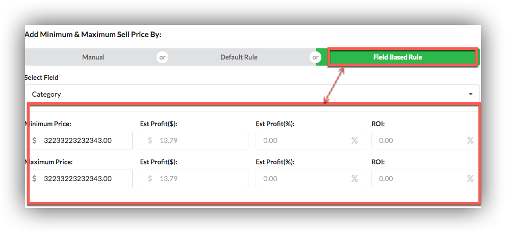

# FIELD BASED MIN/MAX PRICES

## MIN/MAX PRICE

our reprice have page Field Base Min/Max Price on which users can set field base rules.

User can select field from drop down If he select category then another values dropdown will show which contains all categories of products.

After selecting field user will set minimum  and maximum sell price  fields\(Price, Plus/Minus, Profit, % or $\).

If user click on submit button field base rules will added.

  
Users can Edit and Remove these field base rules by clicking Edit or Remove button.

After setting field base rules when user can open edit product Reprice tab all three type of field base rules will shown:

* Manual
* Default Rule
* Field Based Rule

#### Manual

In manual user can set these fields manually

#### Default Rules

These fields will automatically filled according to default rules that user have set in reprice field base setting.

####  Field based Rule

last one is Field based Rule, Here is a drop down of fields according to which field base rule will applied.

  
After selecting field rule will applied

  

