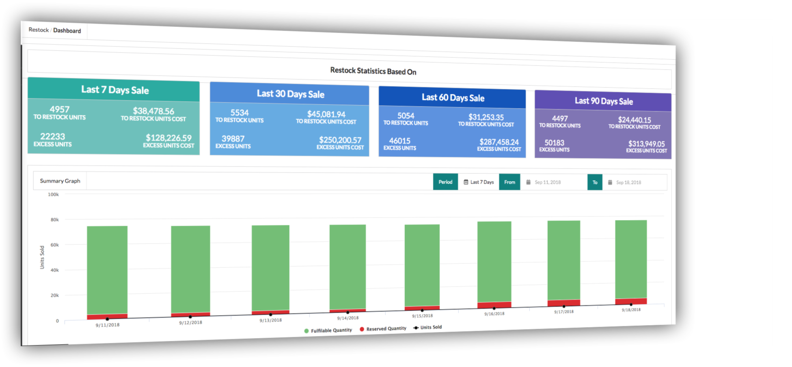
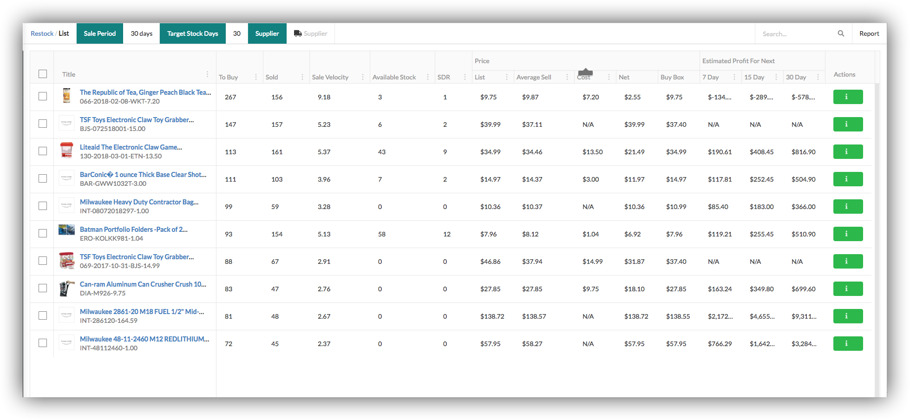
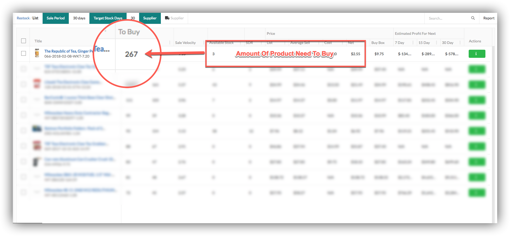
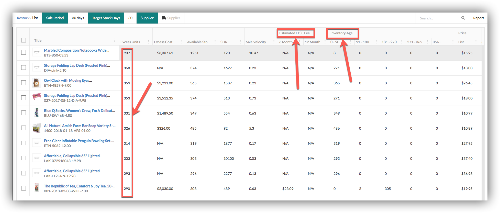
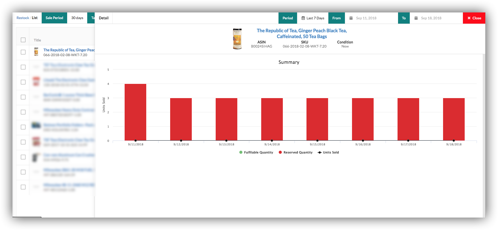
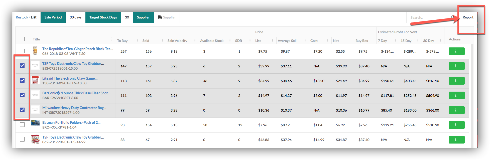
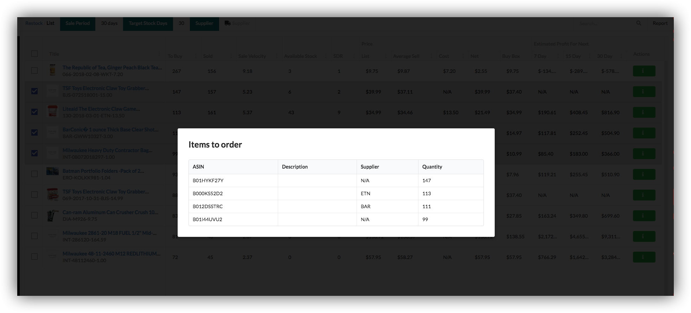

# RESTOCK

## Dashboard

 Our restock has a Dashboard page which enables our users to check statistics of sale based on different ranges.

## To Restock Products 

our restock has a To Restock Products page which enables our users to view products which need to restock.

### To Buy  

To Buy showing amount of product need to buy.Formula used to calculate to buy amount :   
**\(targetStockPeriod + supplierLeadTime - stockRemainingDays\)\) \* saleVelocity\)**  

## Over Stocked Products

overstocked page in which we facilitating our users to view how much your products are overstocked in amazon, showing estimated fee and inventory age.  
Excess Units shows overstocked amount.

  

## Detail/product

By clicking Detail button enabling our users to view stats of product how much it sales in any number of days.Detail of product is same in overstocked page as well as To Restock Products page.

## Report

By clicking report button we can view description, quality and supplier of product.Same in Over Stocked page as well as in restock products page.

