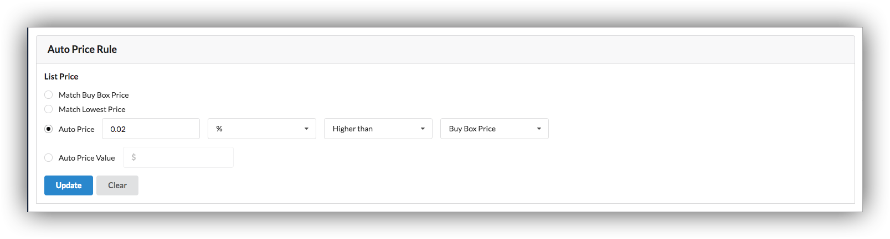
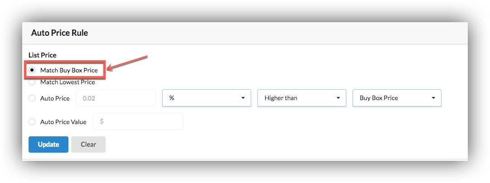
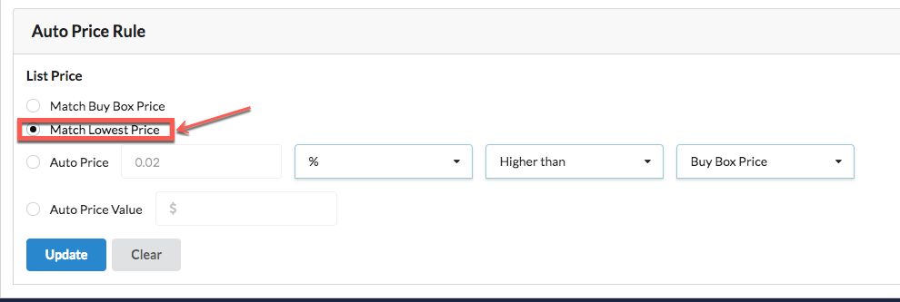
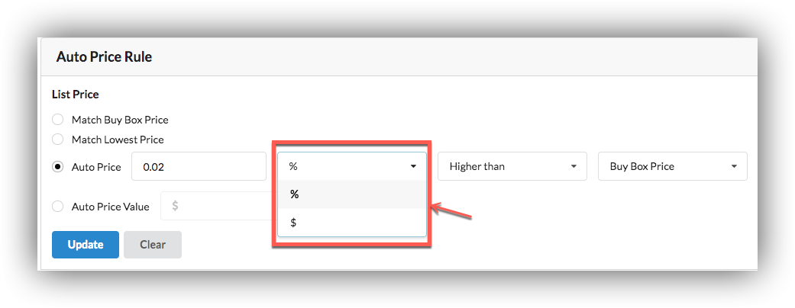
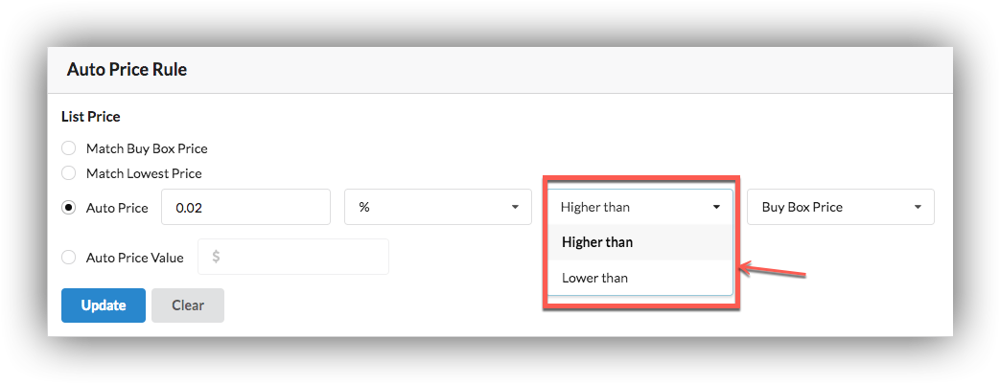
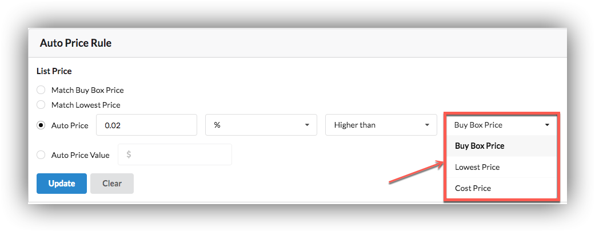
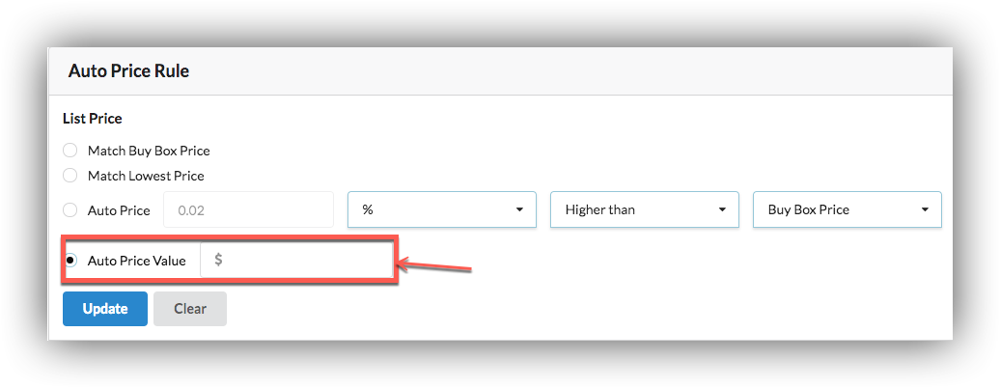

# Autoprice Rule

Our users can set auto price rules, so when users will create product, list price will set according to rule.

**Match Buy Box Price**

We collect offers of that ASIN or SELLER SKU from amazon if any buy box price available and it lies in min/max price rule then our product price will buy box price.

**Match Lowest Price** 

We collect offers of that ASIN or SKU from amazon if any Lowest price available and it lies in min/max price rule then our product price will lowest price.

**Auto Price**

We are providing options to set how much your product price in \(% or $\) will higher than or lower than \(buy box price, lowest price or cost price\).

**Auto Price Value**

We are providing option to set static auto price value.

