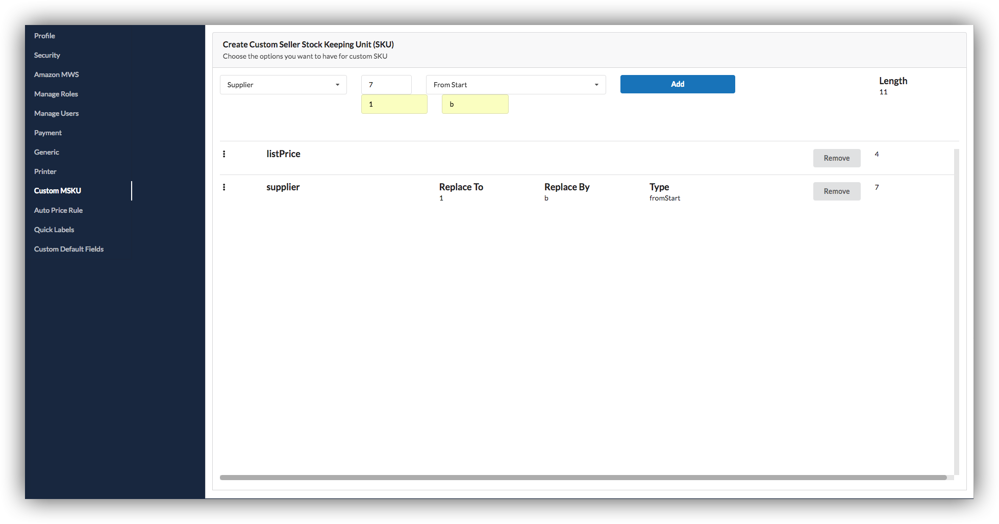
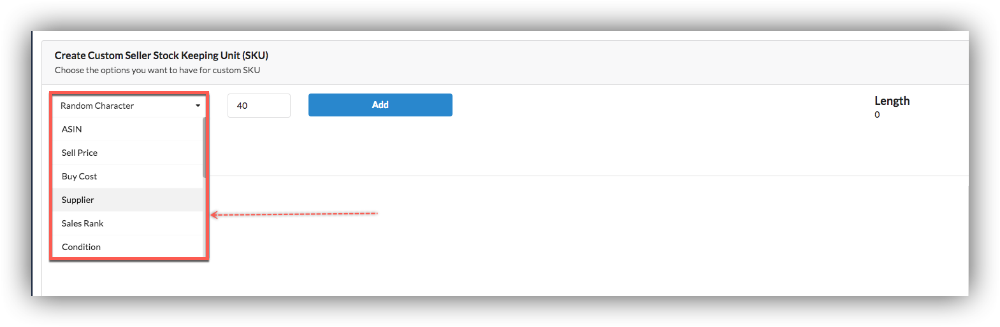
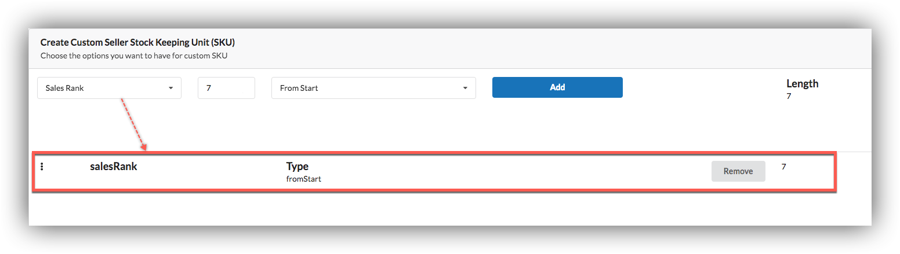
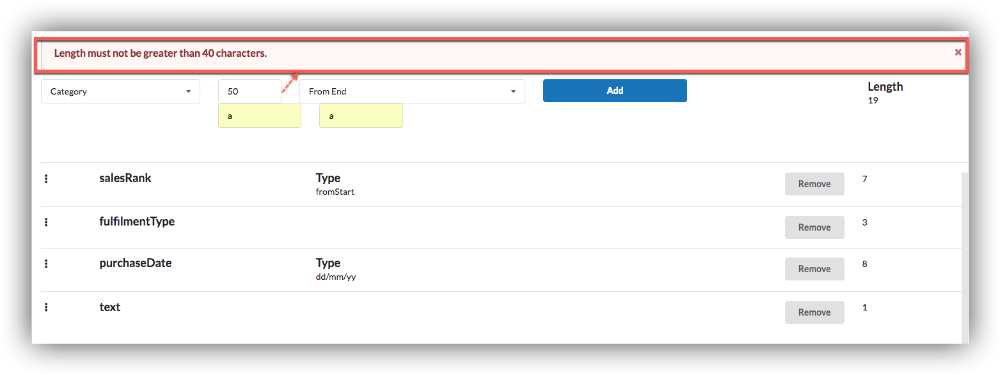
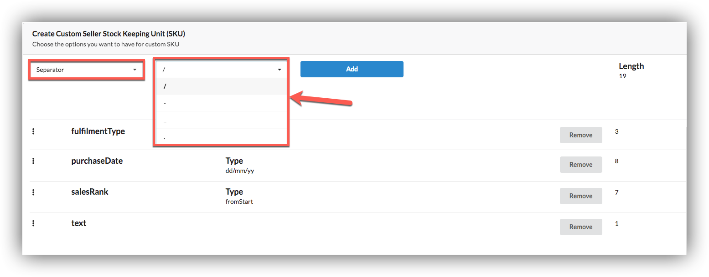
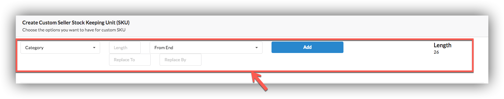
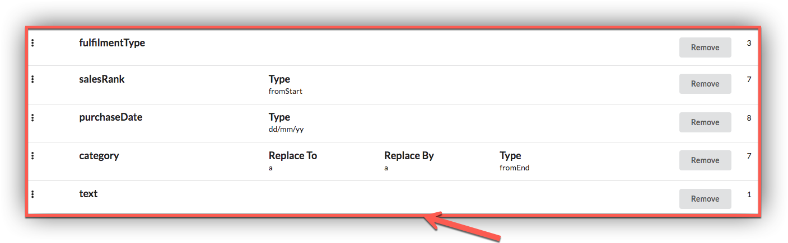
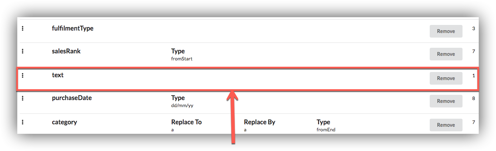

# Custom SKU

The One App allows you to automatically create information rich Merchant SKUs when listing products. 

## Step 1

Select from the drop-down box what information fields you want auto-generated during MSKU creation.  

After clicking Add button option will selected. you can choose more than one options but length must not be greater than 40.

we have provide a separator option for our users.

After selecting options we are showing respective fields.In case of category users have to write length and select options From End or From Start, Replace To and Replace By.

We can also change positions of selected options by dragging up or down

Before

Position of Text changed after dragging up.

  

