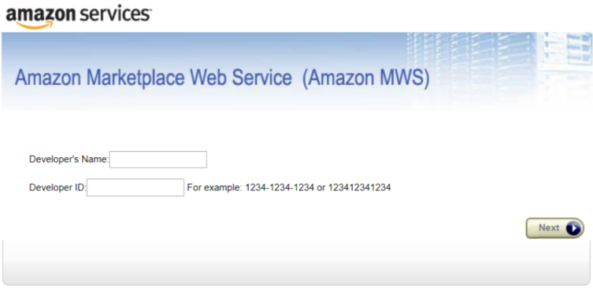

# MWS Setup

## Step 1

Authorize the app in Seller Central. Go to Amazon Seller Central and click the **`Settings`** button and then choose **`User Permissions`**. ****

## Step 2

Scroll down to Amazon MWS Developer Permissions and click the **`Authorize a developer`** button.

## Step 3

Copy the following and select Next:

**Developers Name:** MinMaxInd  
**Developer ID:** 6827-5609-8009

##  Step 4

Check the box on the next page to display. 

## Step 5

Copy the Seller ID and MWS Auth Token you get from the form above into the “[Setup](https://oneapp.minmaxind.com/settings)” form in the One App.

### 


Give the Sync process time to complete \(it will vary depending on the number of items in your catalog\). Once the process completes you will see all of your inventory items in the Inventory page. The process might take approximately three to four days. You can see the current status of the Sync process on the [Background Jobs Timeline](https://oneapp.minmaxind.com/background-tasks) page.


