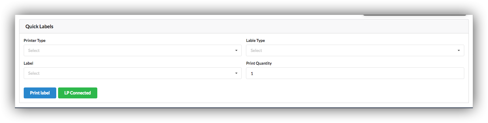
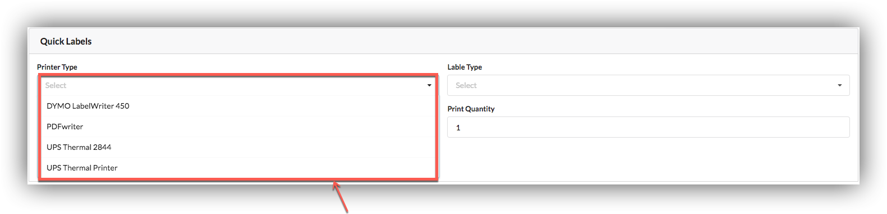
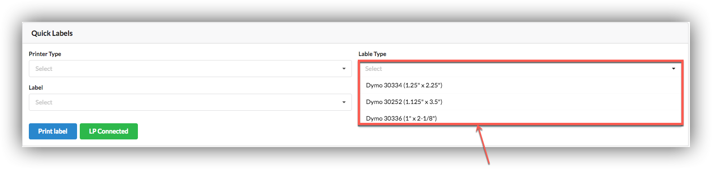
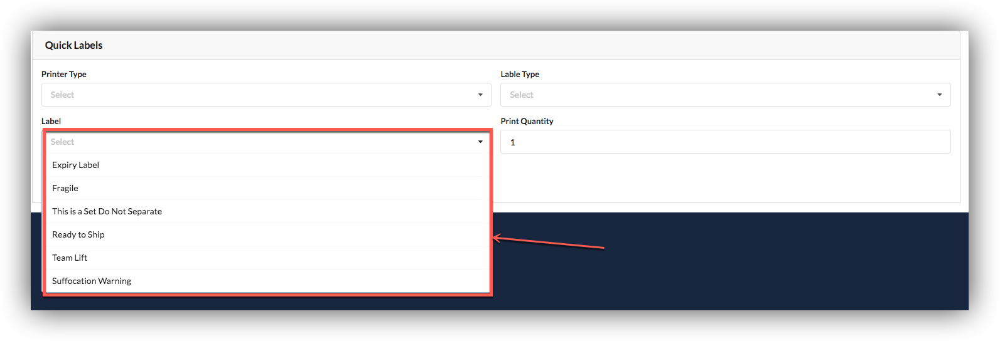

# Quick labels

our users can get quick labels according to type of products in box.

Users can set type of printers.

Users can set label type.

Users can set label according to type of products in Box.

At last user will set no of print quantity.

On clicking print label printer will print labels according to settings.

