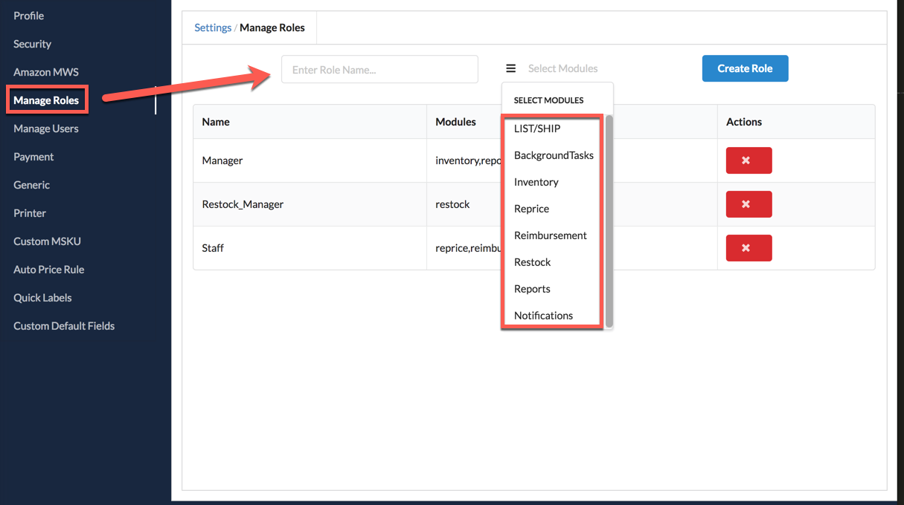
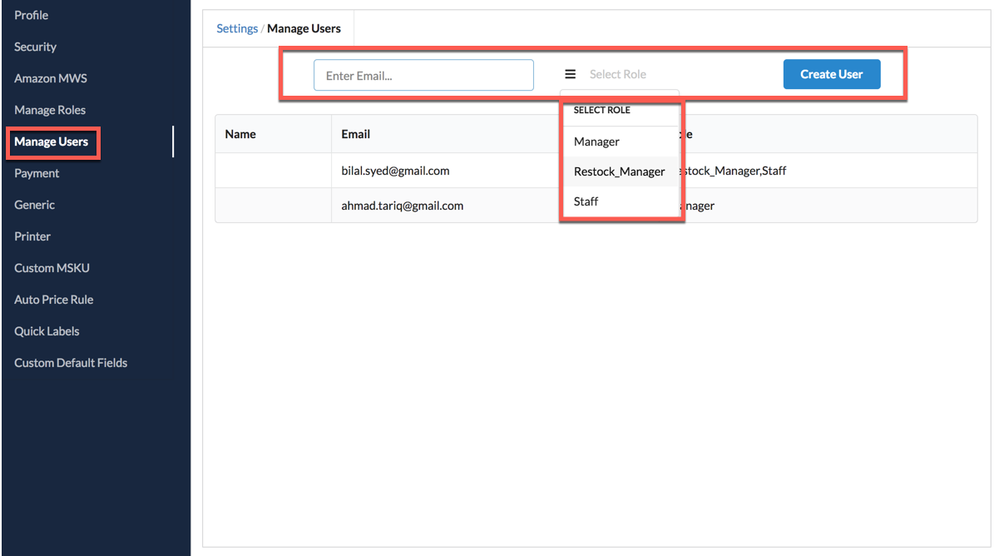

# User Permissions

You as the owner of your One App account have full administrative control over your account. The One App also supports limited roles \(Permissions\) for other users that you can setup and control individually. So you can allow your prep and ship employee to access the list and ship functionality to perform their job without them being able to access your One App Reprice settings. You could give your accountant access only to your reports so that they can look at your Profit and Loss statements. You may have X roles and give up to Y employees access to your account.

## STEP 1: MANAGE ROLES

On the [Manage Roles](https://oneapp.minmaxind.com/settings) page you can create roles. You can select individual modules for which you want to give access to that particular role.   
Common Roles and their matching Modules would include:

* Warehouse Employee-LIST/SHIP
* Accountant/Bookkeeper-Reports
* General Employee-Everything except Reports and Reprice.

## STEP 2: MANAGE USERS

Now go to the [Manage Users](https://oneapp.minmaxind.com/settings) page where you can give people access to your One App account with the role\(s\) created in Step 1. Set user permissions by assigning different roles to a user. One user can have multiple roles assigned to them.

