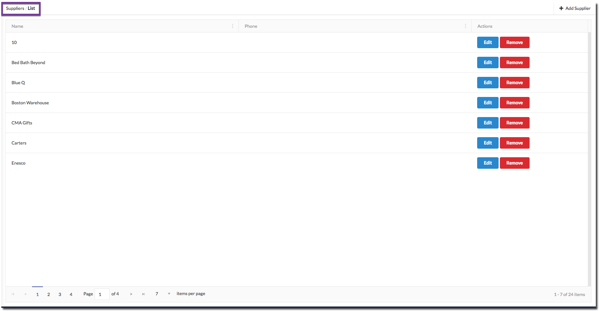
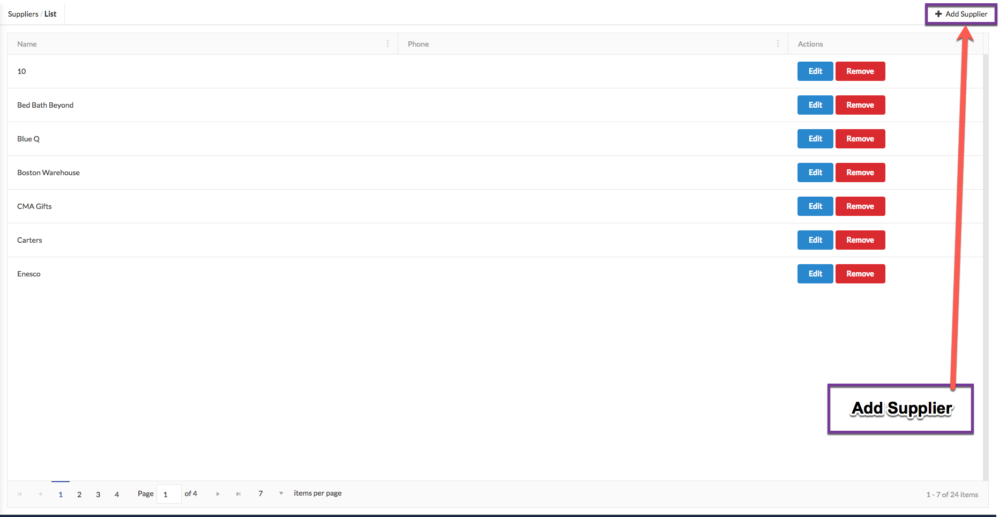
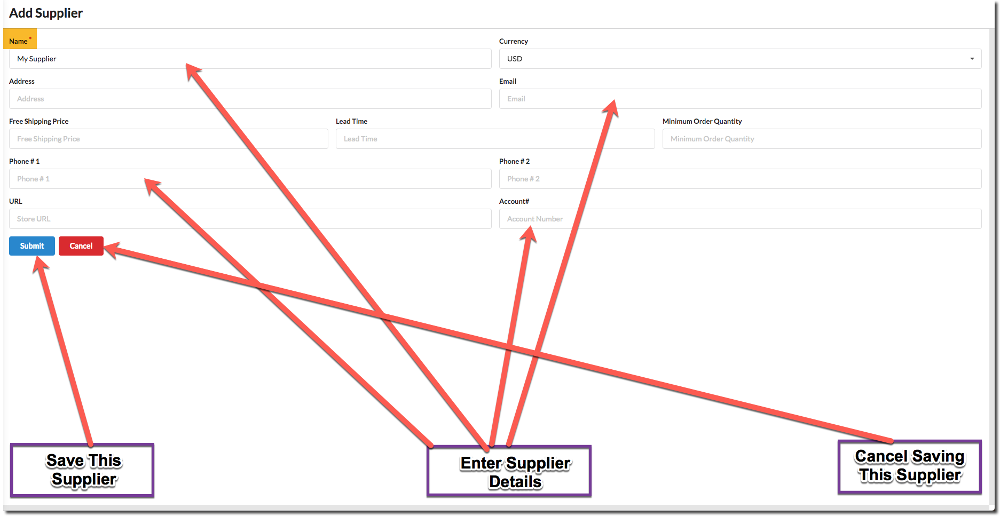
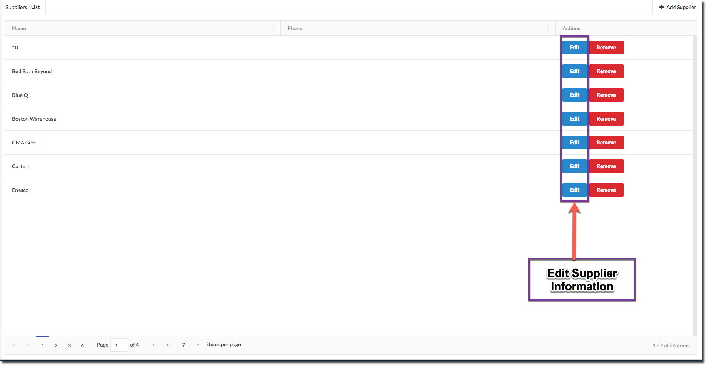
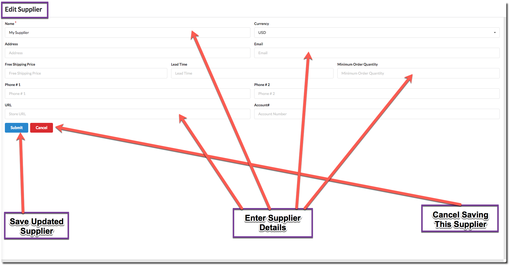
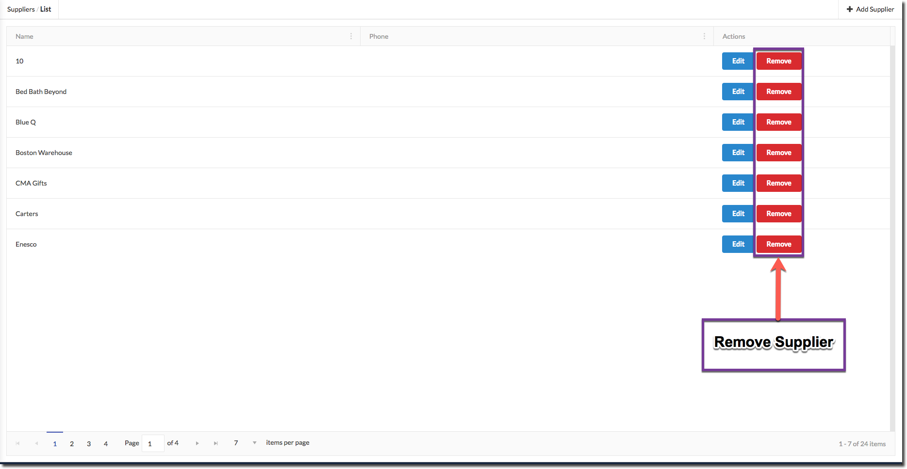

# Supplier

## List

To View Suppliers go to **List/Ship → Suppliers** page.

## Add

Click on `Add Supplier` button to add a Supplier.

## Edit

Click on `Edit` button in front of Supplier to edit a Supplier.

## Remove

Click on `Remove` button in front of Supplier to remove a Supplier

