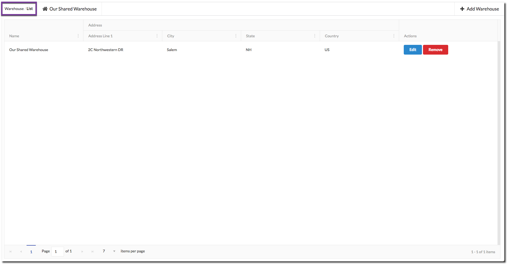
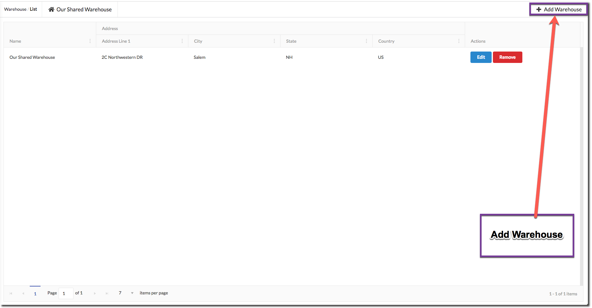
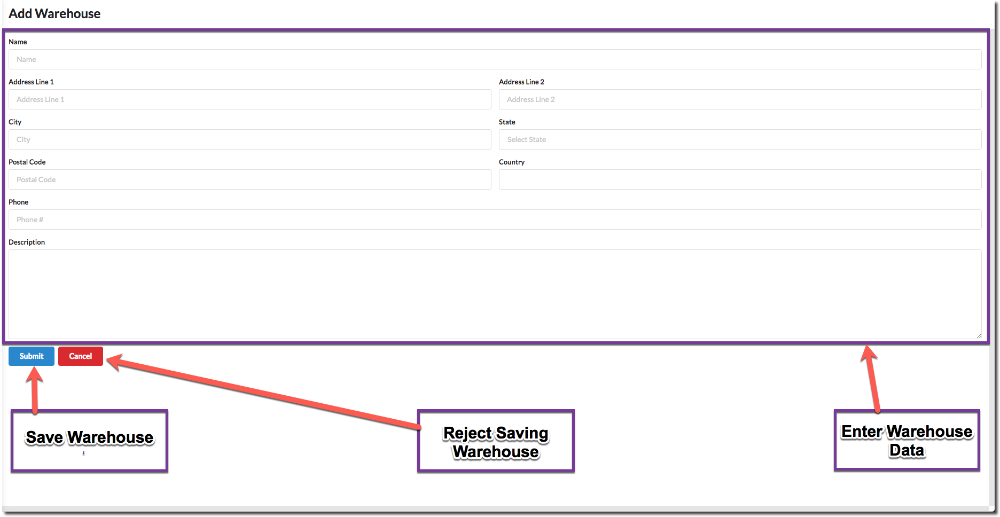
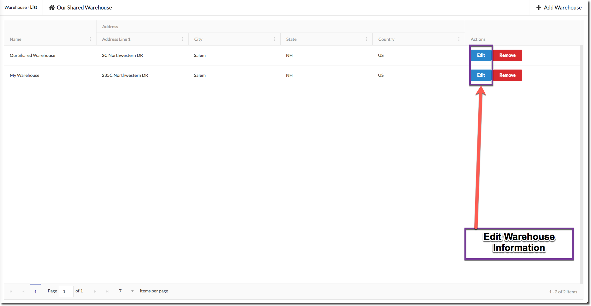
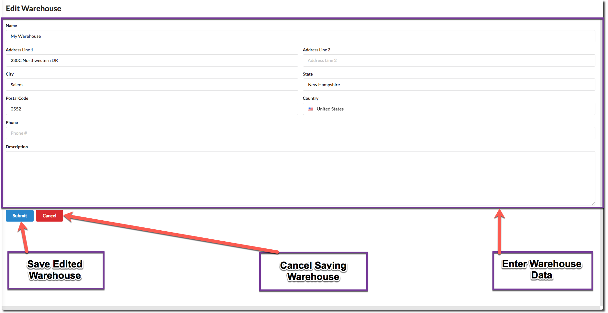
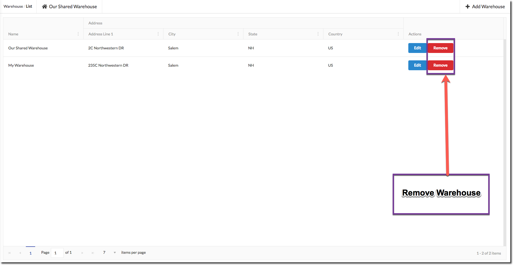

# Warehouse

## List

To View Suppliers go to **List/Ship → Warehouses** page.

## Add

Click on `Add Warehouse` button to add a Warehouse.

## Edit

Click on `Edit` button in front of Warehouse to edit a Warehouse.

## Remove

Click on `Remove` button in front of Warehouse to remove a Warehouse.

